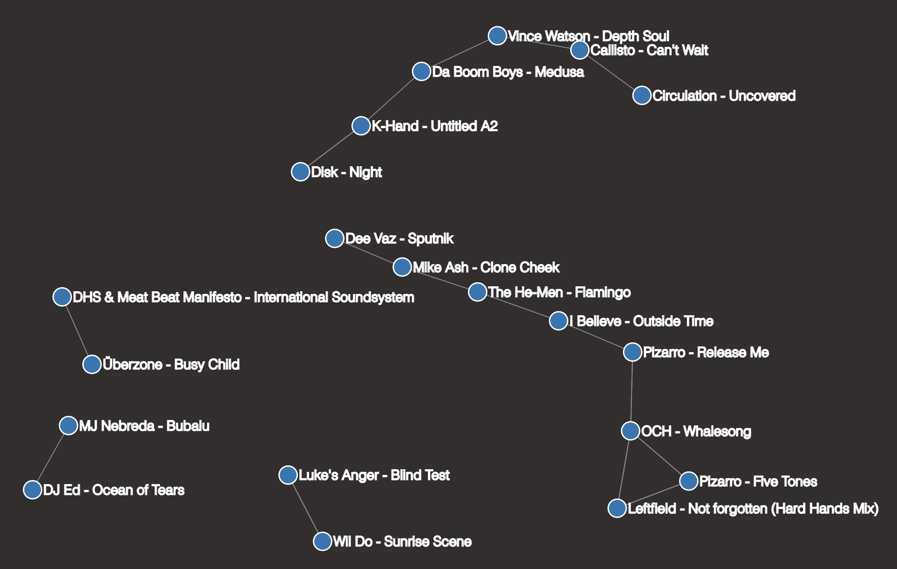

# Mix Memory

## Intro

Mix Memory is a proof-of-concept feature suggestion for AlphaTheta's Rekordbox software, 
developed in Python and visualized using d3.js.

The idea is to provide DJs with a tool to store and recall successful track transitions, 
helping them build a personal library of tried-and-tested track pairs or "set pieces."

The industry standard DJing software is AlphaTheta's Rekordbox. At the moment, Rekordbox
does not offer a way to save good transitions. Ideally, a DJ would be able
to use Rekordbox during a performance to save pairs of tracks that worked well together. 
In future, when they are playing a track and unsure which track to play next, they 
could recall their previously saved transitions from this track to others, providing a 
list of tried-and-tested options for the next track.

This collection of track pairs is represented by a graph network. Each track in a DJ's
library is a node, and each pairing is saved as an edge. These edges could be 
unidirectional (Track A transitions well into Track B, but not vice versa) or 
bidirectional (mixing in both directions works well).

## Installation

To install the Python package, run

``` sh
pip install .
```

## Examples

There is an example script at `examples/example.py` which showcases:
1. Creating a track library
1. Creating a track network and adding connections
1. Saving and loading these objects to/from a database
1. Recommending next tracks from a currently-playing track
1. Visualizing the network using d3.js

### Example visualization

TODO: add directionality to d3 visualization



## Ideas for future development

### Weights

The network edges could have weights, representing the quality of the transition. In
practice, a DJ could then not only save a transition, but also rate it out of 5 based on
how smooth or energising it was.

### Suggested next tracks

A recommendation engine could be built to suggest transitions based on track features
e.g. shared key, rhythms etc.

### Shortest path

A DJ may aim to get from one track to another in the quickest way possible. This would
of course only be possible with a very well-populated network, but it is basically
the shortest path between two network nodes.

### Best path

A DJ may aim to get from one track to another via the best possible transitions. This 
would of course only be possible with a very well-populated network, but it could be
derived from the path with the highest average weight per network edge.
